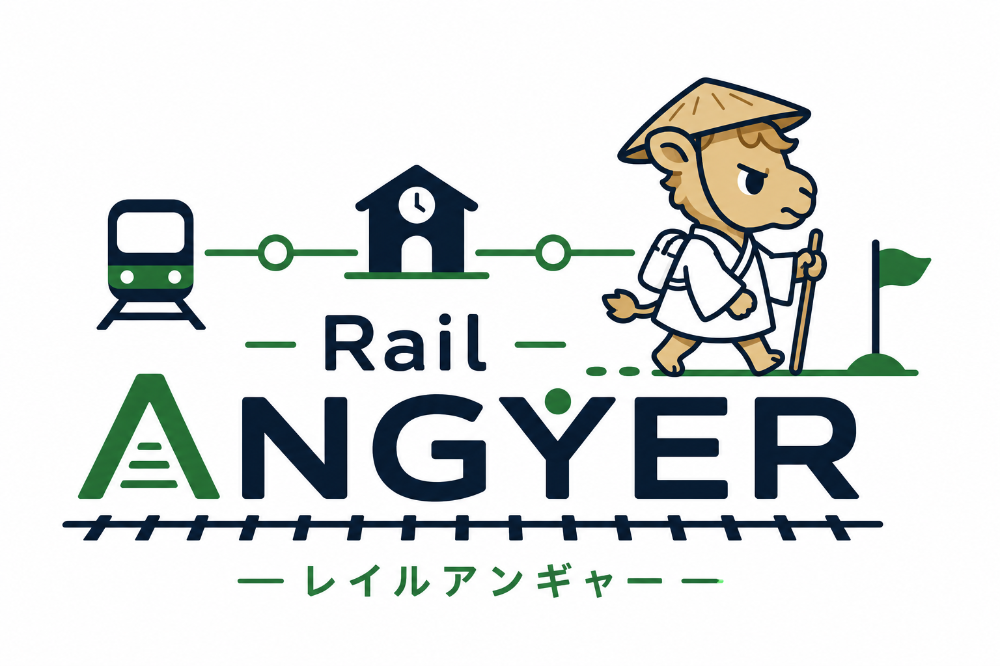

# RailAngyer — レイルアンギャー

サイコロで駅を巡る徒歩すごろくアプリ（身内向け / iOS・SwiftUI）。

「鉄道（Rail）」×「行脚（あんぎゃ）」。
実際に鉄道の駅を歩いて巡り、サイコロの出目だけ駅を進み、着地した駅でチームのミッションを行う。
第1弾は札幌市営地下鉄 南北線（麻生〜真駒内、16駅）。

## ドキュメント

| ファイル | 内容 |
|---|---|
| [files/01_企画仕様書.md](files/01_企画仕様書.md) | コンセプト・コアループ・可変ルール・決定事項 |
| [files/02_データ設計.md](files/02_データ設計.md) | 初期のデータ設計（ver.1。考え方の記録） |
| [files/03_Azure構成と料金.md](files/03_Azure構成と料金.md) | Azure の構成・無料枠・実際に作成したリソース |
| [files/04_ロードマップ.md](files/04_ロードマップ.md) | 開発フェーズと将来展開 |
| [files/05_フロー仕様.html](files/05_フロー仕様.html) | 状態遷移・ターンの手順・判定ルール・例外処理 |
| [files/06_schema.sql](files/06_schema.sql) | Azure SQL の DDL・南北線16駅の投入・主要クエリ |
| [files/07_データモデル仕様.html](files/07_データモデル仕様.html) | 全10テーブルの列定義・制約・導出値・設計判断 |
| [files/08_画面仕様.html](files/08_画面仕様.html) | 全21画面の表示項目・操作・遷移・実装範囲 |
| [files/09_アプリ用ユーザー.sql](files/09_アプリ用ユーザー.sql) | アプリ／API用の最小権限ユーザーとロール |
| [files/10_アプリ設計.md](files/10_アプリ設計.md) | SwiftDataモデル・状態管理・位置判定・GPXテスト手順 |
| [files/11_API設計.md](files/11_API設計.md) | フェーズ2のAPI。認証・エンドポイント・冪等性・Blob |
| [files/12_migration_v3_token.sql](files/12_migration_v3_token.sql) | メンバートークン用のスキーマ移行（適用済み） |
| [files/13_courses.sql](files/13_courses.sql) | 東西線・東豊線・山手線の投入（適用済み） |
| [files/18_courses_v2.sql](files/18_courses_v2.sql) | 札幌市電の投入と山手線の座標更新（適用済み） |
| [files/19_courses_v3.sql](files/19_courses_v3.sql) | 阪急京都本線の投入（**未適用**。アプリはJSONから読むので動作には不要） |
| [files/14_引き継ぎ.md](files/14_引き継ぎ.md) | **引き継ぎ資料**。環境・コマンド・落とし穴・途中の作業 |
| [tools/asc-crashes.py](tools/asc-crashes.py) | TestFlightのクラッシュ報告を取り出す（鍵の作り方は `15_TestFlight準備.md` §8） |
| [tools/asc-whattotest.py](tools/asc-whattotest.py) | TestFlightの「テスト内容」を登録する（**Xcodeからの送信では付かない**） |
| [files/15_TestFlight準備.md](files/15_TestFlight準備.md) | v1.0の署名・メタデータ・プライバシー・配布手順 |
| [files/16_プライバシーポリシー.md](files/16_プライバシーポリシー.md) | TestFlight／App Store向けのプライバシーポリシー |
| [files/21_利用規約.md](files/21_利用規約.md) | 利用規約（安全・お題・写真・免責）。**アプリにも同梱**して圏外でも読める |
| [files/20_migration_v5_mission_visibility.sql](files/20_migration_v5_mission_visibility.sql) | お題の見え方のDB移行（**未適用**） |
| [files/17_migration_v4_schedule_rules.sql](files/17_migration_v4_schedule_rules.sql) | 予定ルールと札幌駅座標のDB移行（適用済み） |
| [RailAngyerCore/](RailAngyerCore/) | ルール計算と駅マスタ（GPS・DB非依存。`swift test` で検証） |
| [RailAngyerApp/](RailAngyerApp/) | iOSアプリ（XcodeGen。`xcodegen generate --spec RailAngyerApp/project.yml`） |
| [RailAngyerApi/](RailAngyerApi/) | ASP.NET Core の API（フェーズ2。`dotnet test` で検証） |
| [tools/](tools/) | シミュレータ用のGPXルート（南北線の歩行を再現） |

`.html` はブラウザで開いてください。

## 現在地

フェーズ1〜4の「作るもの」は一通り実装済み。
**残りは実機での2台通し確認と、座標・テンポ・電池を確かめる実地テスト。**

- Azure SQL Database 作成済み（無料オファー / Japan East / サーバーレス）
- スキーマ適用済み（10テーブル、南北線16駅を投入）
- アプリ用の最小権限ユーザー作成済み
- iOSアプリ：フェーズ1の実装は完了。**実地テスト待ち**
- API：参加・ミッション・進行・写真・予定まで実装（54テスト）
- **App Service（Linux / F1 無料 / Japan West）にデプロイ済み** —
  `https://railangyer.azurewebsites.net/health/db` が DB まで疎通
- 写真：ストレージ・コンテナ `photos` 作成済み。**SAS発行 → Blobへ直接アップロード →
  メタ登録 → 表示 → 削除を実物で確認済み**
- アプリ：ホームから明示的に開始し、参加/ルーム・お題・予定・進行を扱う構成
- 記録：複数の旅、実写真の地図ピン、時間、分/km、連続ペース色まで実装
- 予定：ルールセットを先に決め、日本時間・日本のカレンダーで作成
- 駅座標：札幌3路線を国土数値情報 N02-22（JGD2011）へ補正済み
- コースは6本（南北線・東西線・東豊線・山手線・札幌市電・阪急京都本線）。設定から切り替えられる。
  **山手線と市電は一周でき、内回り／外回りを選べる**
- コースは **国 → 都道府県 → 路線** の順にたどって選ぶ。
  都道府県をまたぐ路線（阪急京都本線）は、通るどちらの県からも見つかる
- 予定・お題・ターン中の各画面に**区間の地図と、歩く距離・時間の目安**を出す
  （直線距離に迂回1.3倍を掛けて時速5km。経路探索はしない）
- 予定は**アプリの外へ共有できる**。日時・集合場所・区間・目安・出欠を1つの文にする。
  **地図ではなくアプリへ誘う** — リンクを開くとそのままルームに参加できる
  （アプリを入れていない相手のために、招待コードも文字で残す）
- お題は**「当日までのお楽しみ」か「いつでも見える」かをルームごとに選べる**。
  伏せる設定では**サーバーが他人のお題を返さない**（通信を覗いても見えない）
- 旅を始めるときは、**立ててある予定から選べる**。予定のルールをそのまま移して始める
- 地図の**施設アイコンを押すと情報が出る**（分類・住所・電話・マップアプリへの引き渡し）
- **遊び方**を初回に出し、設定からいつでも読み返せる。利用規約も同梱
- TestFlight v1.0.0 (1)：App Icon、起動画面、プライバシーマニフェスト、
  配布文面、Explicit App IDを用意し、ビルド1をApp Store Connectへアップロード済み。
  緑アイコンと新UIのビルド2もApp Store Connectへアップロード済み（処理中）
  （`15_TestFlight準備.md`）
- **フェーズ2〜4の作るものは揃った。**残るは実機での通し確認と実地テスト

## テスト

```bash
swift test --package-path RailAngyerCore     # ルール計算・駅マスタ・ペース・見積もり 76件
tools/prepare-simulator.sh "iPhone 17 Pro"   # UIテストの前に位置情報を許可する（初回・新環境）
xcodebuild -project RailAngyerApp/RailAngyerApp.xcodeproj -scheme RailAngyerApp \
  -destination 'platform=iOS Simulator,name=iPhone 17 Pro' test   # 153件 + UI 12件
dotnet test RailAngyerApi.Tests               # API 58件
```

> ⚠️ `tools/prepare-simulator.sh` を飛ばすと、位置情報の許可ダイアログが操作を塞ぎ
> `ArrivalUITests` の自動到着だけが落ちる（アプリの不具合ではない）。
>
> ⚠️ **UIテストは同じシミュレータで続けて流すと詰まる。** 地図を描く画面が多く、
> 何度も繰り返すと `Test crashed with signal kill.` / `Restarting after unexpected exit`
> が並ぶ。**アプリは落ちていない**（手で起動すれば動く）。
> `xcrun simctl shutdown` → `erase` → `boot` → `prepare-simulator.sh` で作り直せば戻る。
> 疑わしいときは**変更前のコミットでも**同じ顔ぶれが落ちるか確かめる。
> ユニットテスト127件はこの影響を受けない。
